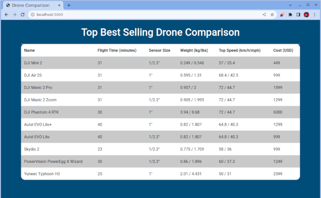

# Sample Flask App

Flask Web App showing the top 10 drones and some information about them. 



This is code from my article, [Building a Web App with Flask and Python: A Beginner's Guide](https://www.jeremymorgan.com/tutorials/python-tutorials/python-flask-web-app/)


Also featured on the [Python Power Hour](https://www.twitch.tv/jeremymorgan)

## Running these files

Have Python installed on your machine.

Create a new Python environment.

run:

```
pip install -r requirements.txt
```

Enjoy!
